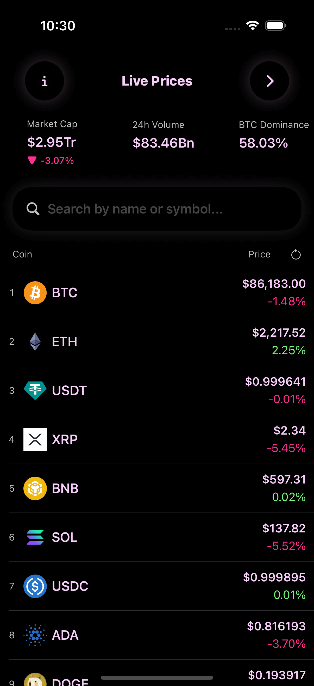
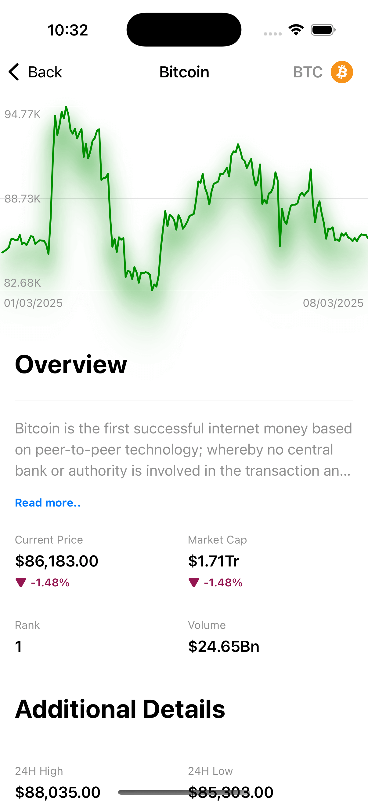
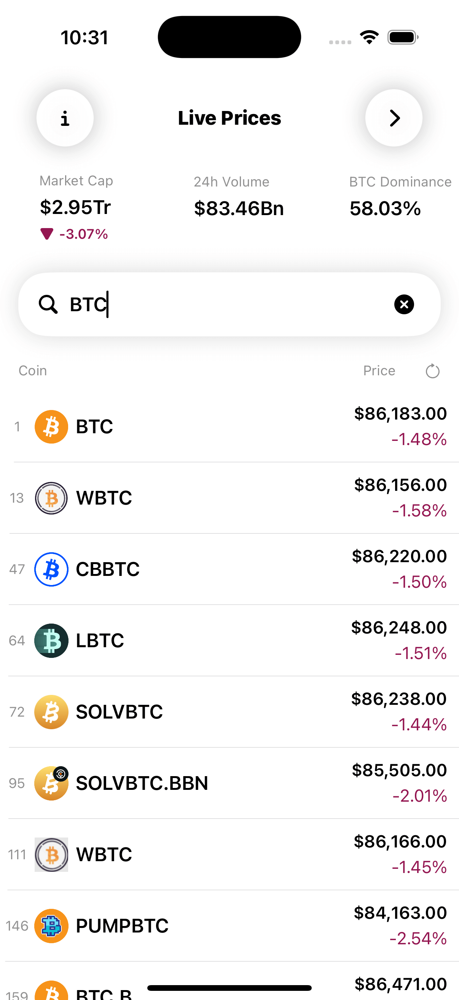

# 🚀 CryptoApp

CryptoApp is a SwiftUI-based iOS application that allows users to track and explore cryptocurrency prices in real time. The app provides a modern and interactive user experience, fetching live crypto data from an API.

## 📌 Features

- 📊 **Real-Time Prices** – Get updated cryptocurrency prices dynamically.
- 🔍 **Search Functionality** – Easily search for your favorite cryptocurrencies.
- 📈 **Detailed Coin Info** – View detailed information, including price history and market cap.
- 🎨 **Modern SwiftUI Design** – Beautiful and smooth UI with animations.
- 🌙 **Dark Mode Support** – Seamlessly switches between light and dark mode.

## 🛠️ Technologies Used

- **Swift** – Programming language for iOS development.
- **SwiftUI** – Modern UI framework for building interactive interfaces.
- **Combine** – Reactive programming for handling API data.
- **Networking** – Fetching live cryptocurrency data using APIs.

## 📷 Screenshots
### Live Prices (Dark Mode)


### Live Prices (Light Mode)


### Coin Details


### Live Search


### My Portfolio


## 🏗️ Installation & Setup

1. Clone the repository:
   ```sh
   git clone https://github.com/mohebboules/CryptoApp.git
   ```
2. Open the project in Xcode:
   ```sh
   cd CryptoApp
   open CryptoApp.xcodeproj
   ```
3. Install dependencies (if applicable):
   ```sh
   swift package resolve
   ```
4. Run the app on a simulator or a real device:
   ```sh
   Cmd + R
   ```

## 📌 Requirements

- macOS with **Xcode (latest version)** installed.
- iOS **14.0+**
- Internet connection for live data fetching.

## 👨‍💻 Author

Developed by **Moheb Boules** – [GitHub Profile](https://github.com/mohebboules)

---

⭐ If you like this project, consider giving it a star on GitHub!

